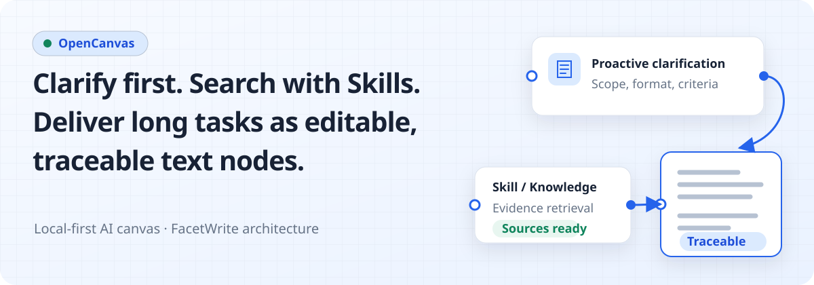
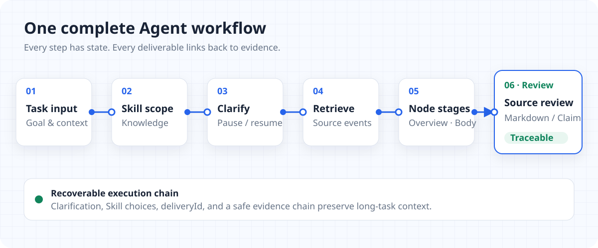

<p align="center">
  
</p>

<p align="center">
  <strong>English</strong> · <a href="./README.zh-CN.md">简体中文</a>
</p>

<p align="center">
  Put proactive clarification, Skill-guided retrieval, long-task delivery, and source tracing on one local canvas.
</p>

## See the real product first

<p align="center">
  
</p>

OpenCanvas organizes canvases, conversations, and Agent work by project. The home screen creates and restores projects; inside a workspace, project and task context sit on the left, an editable Canvas occupies the center, and the Agent collaboration drawer stays on the right. The React Flow canvas supports document, note, reference, and Role nodes, plus edges, selection, dragging, zooming, and session undo.

<p align="center">
  
</p>

Model credentials are separate from Agent configuration. Chat, Embedding, and optional rerank models become callable through local Model Config bindings; an Agent then selects its Knowledge Bases, tools, Skills, MCP, and Memory. The Knowledge Base screen manages imports and indexing state and provides one-shot retrieval testing, so these controls participate in the real runtime path.

## One complete Agent workflow

<p align="center">
  
</p>

1. **Proactive clarification:** when the request is underspecified, the Agent emits a structured question; the question, options, and answer are persisted before the original task continues.
2. **Skill-guided search:** Skills enabled for this message and the tool policy constrain the execution path; retrieval and file tools produce auditable runtime events.
3. **Staged node delivery:** long tasks place overviews, research or progress excerpts, body drafts, final body content, files, and sources on the Canvas in stages instead of leaving everything in chat.
4. **Traceable sources:** source URLs, Knowledge retrieval scores, document paths, and body anchors stay with the result so evidence can be revisited and located.

<p align="center">
  
</p>

The important states do not depend on tiny screenshot text: clarification, tool activity, Canvas write requests, delivery nodes, and source metadata are persisted by the backend. The UI is a visual entry point into that state.

## Core capabilities

### Resume long tasks without duplicating the delivery

Long tasks use a stable `deliveryId` to maintain staged `Overview`, research or progress excerpts, `Body draft`, final `Body`, file-document, and `Sources` nodes. Draft checkpoints preserve recoverable work after failure. A retry for the same delivery updates stable nodes and their stage or page metadata instead of forking a duplicate result set.

### Clarification is recoverable state

Agent clarification is not a disposable chat bubble. The question, 2–3 options, answer, resume lifecycle, and Runtime handles are persisted locally. Ordinary tasks support multiple clarification rounds; when resume handles are present, an answer continues the same LangGraph Runtime checkpoint while preserving the original instruction, per-message Skill overrides, tool state, and delivery context. Incomplete resume metadata produces a recoverable error instead of silently starting an unrelated task.

### Clear Skill and tool boundaries

- **Project Skills** live in the project Skill directory and can be grouped, moved, and managed in folders.
- **Agent Runtime Skills** come from the Runtime package and are read-only in the current management UI, preventing local configuration from rewriting Runtime dependencies.
- The composer can enable or disable a Skill for the next message only. The override clears after a successful send, an Agent switch, or a conversation switch and does not rewrite Agent or project defaults.
- The Skill catalog exposes source, allowed tools, Runtime tool mapping, execution mode, and risk level metadata. Actual calls still pass enabled-state, external-configuration, permission, and approval checks.

### Local RAG Knowledge Bases

Knowledge uses embedjs with a local LibSQL vector store and accepts files, notes, text, URLs, and sitemaps. A new base binds to a configured Embedding model and can optionally bind a rerank model. Retrieval supports selected bases, result count, a score threshold, and one-shot testing. If reranking fails, OpenCanvas keeps vector-similarity ordering and records the failure instead of discarding usable results.

### Return from a result to its source

Knowledge results preserve source, title, metadata, and retrieval score; linked research or progress nodes accept sanitized HTTP(S) sources only. Claim Review in the Markdown preview persists `sourceDocumentPath`, `sourceAnchor`, `citationUrls`, and evidence text. A candidate Claim creates Canvas nodes only after explicit user selection. Automatic knowledge graphs, cross-project historical deduplication, evidence-strength scoring, and complete citation management remain future work.

## Quick start

This is a **Windows source-development Shell**, not an installer. Before starting, prepare:

- Node.js 22+
- `uv`; it manages Python 3.12
- At least one enabled chat model saved in Model Config with an API key

Double-click `start-opencanvas-shell.vbs` from the repository root, or run:

```powershell
.\start-opencanvas-shell.vbs
```

You can also start the same local development stack through npm:

```powershell
npm run dev
```

After startup, check:

- OpenCanvas UI: `http://127.0.0.1:17776`
- API health: `http://127.0.0.1:17777/api/health`
- Agent Runtime status: `http://127.0.0.1:17777/api/agent-runtime/status`
- Runtime health: read the actual Runtime port from the status endpoint, then open `/health` on that port

The default entry forces local Runtime mode and does not start Docker Desktop. Docker remains an explicit optional path.

Run the full local Runtime acceptance through the same launch path as the double-click entry:

```powershell
npm.cmd run acceptance:local-runtime
```

<details>
<summary><strong>Advanced runtime and common commands</strong></summary>

Local Runtime diagnostics and lifecycle:

```powershell
npm run agent-runtime:doctor
npm run agent-runtime:up
npm run agent-runtime:status
npm run agent-runtime:down
```

Explicit Docker mode:

```powershell
npm run agent-runtime:docker:up
npm run agent-runtime:docker:up:local-images
npm run agent-runtime:docker:status
npm run agent-runtime:docker:down
```

Engineering checks:

```powershell
npm run typecheck
npm test
npm run test:frontend
npm run shell:test
npm run test:e2e:canvas
npm run build
```

Use `npm run dev:services` only for narrow Vite and Express API debugging. It is not the complete product path and does not replace Agent Runtime acceptance.

</details>

## Engineering boundaries and documentation

OpenCanvas is the primary product name. `FacetWrite` remains only as the architecture lineage and internal engineering name in code paths, APIs, local data directories, and some technical documents.

The system boundary remains:

```text
React / Vite workspace
  → Express API and product control plane
  → SQLite + local files
  → Agent Runtime sidecar, only through the backend adapter and ToolUse bridge
```

- **Local first:** projects, conversations, Canvas state, settings, run records, and Knowledge metadata use local persistence as their source of truth.
- **The development Shell is not an installer:** Electron owns Windows source-stack startup, health checks, and process ownership without changing the Web/API architecture.
- **Writes are controlled:** Agent-requested replacement, overwrite, deletion, and other destructive Canvas operations must enter the pending approval path. Lower-risk create and append operations still take effect only through backend policy and real commit events.
- **Cloud collaboration is not delivered yet:** accounts, workspaces, sync, presence, comments, permissions, and share links wait until the local canvas model and Agent tool boundary are stable.

### Technical documentation

- [Project Brief](./docs/PROJECT_BRIEF.md)
- [System Architecture](./docs/ARCHITECTURE.md)
- [Canvas](./docs/CANVAS.md)
- [Agent and Tools](./docs/AGENT.md)
- [Agent Runtime Runbook](./docs/AGENT_RUNTIME_RUNBOOK.md)
- [App Shell Runbook](./docs/APP_SHELL_RUNBOOK.md)
- [Skill Management](./docs/SKILL_MANAGEMENT.md)
- [Knowledge Bases](./docs/KNOWLEDGE.md)
- [API](./docs/API.md)
- [Security Boundaries](./docs/SECURITY.md)
- [Claim Review PRD: current state, boundaries, and follow-up work](./docs/plans/CLAIM_REVIEW_PRD.md)

### Roadmap

These are directions, not promises of currently delivered behavior:

1. Complete the board-file model around nodes, edges, assets, workflows, Agent conversations, tool events, approvals, and version metadata.
2. Extend FigJam-style tools and object actions while keeping ordinary visual objects separate from Agent semantic relationships.
3. Refine Canvas tool intents into create, append, connect, layout suggestion, Role suggestion, and selected-chain summary operations.
4. Add asset records, snapshot and version history, and portable `.opencanvas` import/export after the data model stabilizes.
5. Enter accounts, sync, online collaboration, permissions, and sharing only after the local model is stable.
