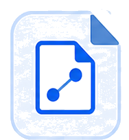

<p align="center">
  
</p>

# OpenCanvas

**Language:** English | [中文](README.zh-CN.md)

OpenCanvas is a local-first AI canvas workspace built on the FacetWrite architecture. It combines a FigJam-like board, editable writing nodes, Agent cards, configurable tools, project history, provider settings, Knowledge, Memory, and an internal LangGraph-based Agent Runtime Gateway for richer AI orchestration.

OpenCanvas benchmarks the familiar board experience first: an infinite canvas, nodes, edges, a floating toolbar, contextual object actions, and local board-file behavior. The product innovation is the Agent layer on top: tool orchestration plus human-AI collaboration context management, where the Agent understands selection, explicit mind chains, workflow stages, Role nodes, and approval state before acting.

## Product Shape

- **Local-first canvas:** Vite/React frontend, Express API, SQLite/local file persistence, and local workspace files under `.facetwrite/`.
- **Canvas V2:** React Flow-based board with an active floating toolbar, select/pan modes, multi-selection, document/note/reference/role nodes, semantic directed edges, free arrows, basic shapes, lightweight tables, local asset cards, workflow stages, Role suggestions, and session undo.
- **Agent Runtime:** LangGraph-compatible AgentBackend Gateway for Lead Agent/subagent orchestration, ToolUse bridge, runtime dashboard, Knowledge, Memory controls, and explicit runtime/model diagnostics.
- **App shell updates:** In the desktop Shell/source-checkout path, the left navigation exposes App Updates for safe Source Git update preview/apply without touching local Project data or secrets.
- **Human-in-the-loop writes:** Agent-originated Canvas changes create pending write requests first. Canvas content changes only after user confirmation or the same-run explicit approval path.
- **Board direction:** OpenCanvas should evolve toward a PS/Figma-like board file that stores nodes, edges, assets, workflow state, Agent conversations, tool events, and write approvals.

## Naming

`OpenCanvas` is the external product name and should appear as the primary UI wordmark. `FacetWrite` is the technical lineage/internal engineering name used by code paths, API boundaries, local data folders, Docker project names, and technical documentation where renaming would create unnecessary migration risk.

## Run

### Windows Development App Shell

For an independent Electron development window with Vite HMR, install dependencies and double-click `start-opencanvas-shell.vbs`, or run:

```powershell
npm.cmd run shell:dev
```

The double-click VBS entry always forces local Runtime mode and lets the shell choose an available Runtime port; machine-level or stale Docker mode variables cannot change that entry. The shell shows startup progress, uses Vite `17776` and API `17777`, and stops Vite/API plus only the Runtime process it created. Docker Desktop is not started or required. This remains a source-development shell, not an installer. See [App Shell Runbook](docs/APP_SHELL_RUNBOOK.md).

Source-checkout updates are available from the left navigation `App Updates` page when running inside the desktop Shell. Browser-only sessions show that Shell source updates are unavailable.

### Recommended: OpenCanvas + Agent Runtime

Use this path for local development. OpenCanvas runs the frontend/backend, while the project-managed Python Gateway runs the Agent Runtime directly. The Gateway exposes the LangGraph-compatible runs API, with `lead_agent` registered from `modules/agent-runtime/backend/langgraph.json` and implemented by `deerflow.agents:make_lead_agent`. Docker Compose remains an explicit isolation and deployment mode. The Agent Runtime Next.js frontend and nginx are not part of the default application path.

Prerequisites:

- Node.js 22+
- `uv` available; it installs project-local Python 3.12 automatically
- npm dependencies installed by the launcher if `node_modules/` is missing
- `.env.local` configured with `AGENT_RUNTIME_MODE=local`, `AGENT_BACKEND_ENABLED=true`, and optional `AGENT_RUNTIME_PORT=0` for automatic Runtime port selection
- Provider values in `.env.local` or `modules/agent-runtime/.env`

Recommended App Shell entry:

```powershell
.\start-opencanvas-shell.vbs
```

Or through npm:

```bash
npm run dev
```

The VBS entry forces `AGENT_RUNTIME_MODE=local`, chooses an available local Gateway port unless `AGENT_RUNTIME_PORT` is set, then starts OpenCanvas. It never starts Docker and only stops the Runtime process it created. Use the explicit Docker commands below for Compose, or use `external` with the PowerShell/npm launcher to connect to a user-managed `AGENT_BACKEND_BASE_URL`.

Useful URLs:

- OpenCanvas App Shell UI: `http://127.0.0.1:17776`
- FacetWrite API health: `http://127.0.0.1:17777/api/health`
- Agent Runtime status through FacetWrite: `http://127.0.0.1:17777/api/agent-runtime/status`
- Agent Runtime Gateway health: read `/api/agent-runtime/status` or `modules/agent-runtime/logs/agent-runtime-local.json` for the actual local port

Useful commands:

```bash
npm run agent-runtime:up
npm run agent-runtime:status
npm run agent-runtime:down
npm run agent-runtime:doctor
```

Explicit Docker mode uses `AGENT_RUNTIME_MODE=docker`, `AGENT_BACKEND_BASE_URL=http://127.0.0.1:2026`, and these lifecycle commands:

```bash
npm run agent-runtime:docker:up
npm run agent-runtime:docker:up:local-images
npm run agent-runtime:docker:status
npm run agent-runtime:docker:down
```

## Commands

| Command | Description |
|---------|-------------|
| `npm run dev` | Start the managed local development stack through `start-facetwrite.ps1`. |
| `npm run shell:dev` | Open the Electron development shell. |
| `npm run dev:services` | Start only Vite and the Express API for narrow debugging. |
| `npm run agent-runtime:up` | Start or refresh the project-managed local Agent Runtime Gateway. |
| `npm run agent-runtime:status` | Read local Runtime ownership/status metadata. |
| `npm run agent-runtime:down` | Stop only the project-owned local Runtime process. |
| `npm run agent-runtime:doctor` | Check local Runtime prerequisites. |
| `npm run typecheck` | Run TypeScript project checks. |
| `npm test` | Run server and lightweight frontend tests with Node's test runner. |
| `npm run test:frontend` | Run frontend-focused Node tests. |
| `npm run shell:test` | Run Electron shell unit tests. |
| `npm run test:e2e` | Run the full Playwright suite. |
| `npm run test:e2e:canvas` | Run the Canvas Playwright suite. |
| `npm run build` | Typecheck and build the Vite app. |
| `npm run preview` | Preview the production build locally. |

### Low-Level Service Debugging

```bash
npm install
npm run dev:services
```

This starts only the Vite frontend and FacetWrite API and is reserved for narrow frontend/backend debugging. Normal local startup should use `start-opencanvas-shell.vbs` so Agent Runtime is started and checked first.

## Acceptance Checks

Run the real Windows launch-to-reply acceptance with Docker stopped and ports `17777` and `17776` free:

```powershell
npm.cmd run acceptance:local-runtime
```

This command starts through `start-opencanvas-shell.vbs`, performs five real no-Mock UI generations in a temporary empty Project, verifies Skill loading plus live Web Search, Memory persistence, and the `canvas_write` approval boundary, then deletes the test Project and closes owned services. It does not intercept generation requests.

- `/api/agent-runtime/status` returns `reachable:true`, `authState:"authenticated"`, `runtimeProvider:"agent-backend"`, `deploymentMode`, and `sandboxProvider`.
- A Summary or Blog generation returns `provider:"agent-backend"`.
- No `agent_backend_runtime_failed` event appears during the primary runtime check.
- `canvas_write` creates a pending write proposal/request only; Canvas content changes only after explicit user confirmation through the approval path.
- Conversation models are selected directly from enabled, keyed chat Model Configs and grouped by capability.
- Runtime/model failures surface explicit diagnostics and do not create Mock messages unless `FACETWRITE_MOCK_FALLBACK_ENABLED=true` is deliberately set.
- Clear context preserves visible history while later runs read only messages after the persisted reset boundary.

## Technical Docs

- [Project Brief](docs/PROJECT_BRIEF.md)
- [Architecture](docs/ARCHITECTURE.md)
- [Canvas](docs/CANVAS.md)
- [UI Assets](docs/UI_ASSETS.md)
- [API](docs/API.md)
- [Database](docs/DATABASE.md)
- [Data Storage And Harness Update Boundary](docs/DATA_STORAGE_SYSTEM.md)
- [Agent And Tools](docs/AGENT.md)
- [Agent Runtime Runbook](docs/AGENT_RUNTIME_RUNBOOK.md)
- [Decisions](docs/DECISIONS.md)
- [First-Stage Source Git Update ADR](docs/decisions/ADR-2026-07-06-use-source-git-updates-for-first-stage-harness-updates.md)
- [Refactor Log](docs/REFACTOR_LOG.md)
- [Maintainability And Concurrency Review Plan](docs/superpowers/plans/2026-06-07-maintainability-concurrency-review.md)
- [Security](docs/SECURITY.md)
- [Development App Shell Runbook](docs/APP_SHELL_RUNBOOK.md)
- [Reference Archive](docs/reference/README.md)

## Roadmap

1. **Board file model:** Treat each project/thread as an OpenCanvas board file that groups nodes, edges, workflow state, assets, Agent conversations, tool events, write approvals, and version metadata.
2. **FigJam-style board tools:** The floating toolbar now covers select, pan, note/text, document, a searchable categorized shape library, tables, free arrows, Role nodes, local assets, and selection-aware Agent actions. Future work can add styling, layers, grouping, rotation, and richer connectors.
3. **Agent-callable board tools:** Extend the current `canvas_write` idea into board-aware tool intents such as creating nodes, appending content, connecting nodes, proposing layout cleanup, creating Role suggestions, and summarizing selected chains.
4. **Local assets and export:** Extend the current local asset records with snapshots/version history and portable `.opencanvas` import/export after the data model is stable.
5. **Online collaboration:** Add accounts/workspaces, sync, presence, comments, permissions, and share links only after the local board model and Agent tool boundary are stable.

## Product Principles

- Local-first before cloud sync.
- Reuse existing Canvas APIs, storage, Agent Runtime adapter, and Tool policy before creating new boundaries.
- Agent actions must be inspectable, reversible where practical, and approval-gated when destructive.
- The board UI should prioritize real creation workflows: fast toolbar access, reliable selection, clean quick actions, and no hidden context surprises.
