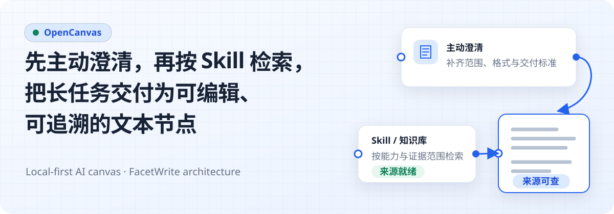
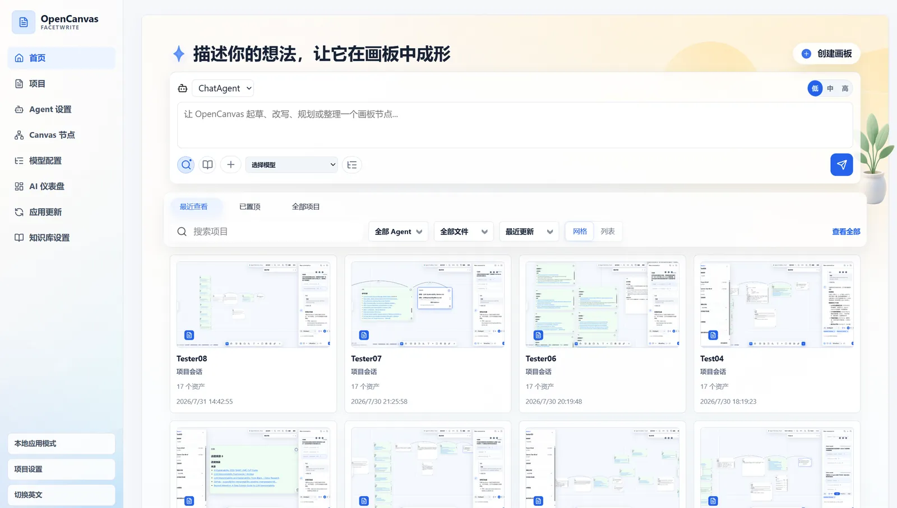
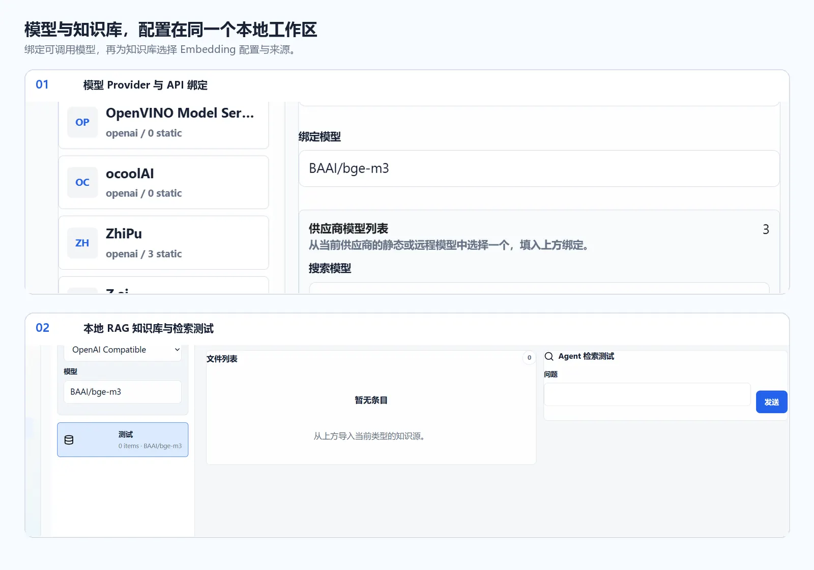
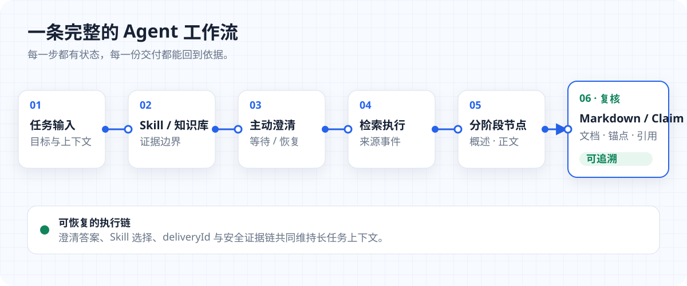
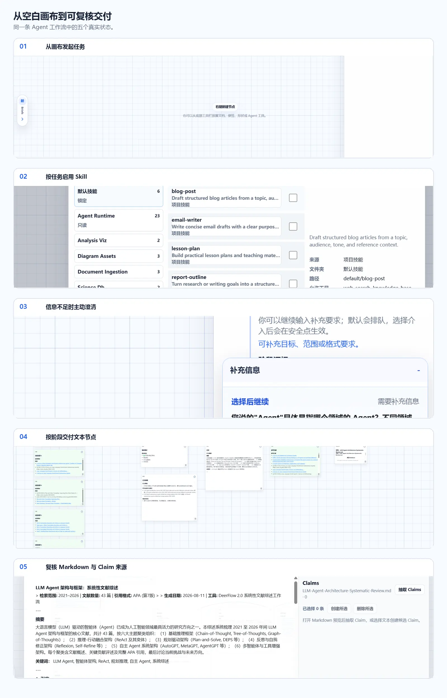

<p align="center">
  
</p>

<p align="center">
  <a href="./README.md">English</a> · <strong>简体中文</strong>
</p>

<p align="center">
  把主动澄清、Skill 驱动检索、长任务交付与来源追溯放进同一张本地画布。
</p>

## 真实产品一览

<p align="center">
  
</p>

OpenCanvas 以项目为单位组织画布、会话和 Agent 工作。首页提供创建与恢复项目的入口；进入工作区后，左侧是项目与任务上下文，中间是可编辑 Canvas，右侧是 Agent 协作抽屉。画布基于 React Flow，支持文档、便签、引用、Role 节点，以及连线、选择、拖拽、缩放和会话级撤销。

<p align="center">
  
</p>

模型凭据不属于 Agent 配置。聊天、Embedding 与可选重排模型通过本地 Model Config 保存为可调用绑定；Agent 再选择知识库、工具、Skill、MCP 与 Memory。知识库管理界面支持导入、索引状态查看和单轮检索测试，因此截图中的配置不是装饰性面板，而是运行时真实使用的控制面。

## 一条完整的 Agent 工作流

<p align="center">
  
</p>

1. **主动问询**：信息不足时，Agent 发出结构化澄清；问题、选项和回答会持久化，回答后继续原任务。
2. **Skill 驱动搜索**：本轮启用的 Skill 与工具策略共同限定执行路径；检索与文件工具产生可审计的运行事件。
3. **节点式交付**：长任务把概述、研究/进度摘录、正文草稿、最终正文、文件与来源分阶段落到 Canvas，而不是只留下聊天文本。
4. **来源可追溯**：来源 URL、知识检索分数、文档路径和正文锚点随结果保存，便于回看证据与定位原文。

<p align="center">
  
</p>

关键状态不依赖截图里的小字：澄清、工具活动、Canvas 写入请求、交付节点和来源元数据都由后端持久化，界面只是这些状态的可视化入口。

## 核心能力

### 长任务续跑，不复制一套结果

长任务使用稳定的 `deliveryId` 维护 `Overview`、研究/进度摘录、`Body draft`、最终 `Body`、文件文档与 `Sources` 等阶段节点。草稿检查点允许失败后恢复；同一交付的重试会更新已有稳定节点及其阶段、页码元数据，而不是分叉出一套重复结果。

### 主动澄清是可恢复状态

Agent 澄清不是一次性的聊天气泡。问题、2–3 个选项、回答、恢复状态和 Runtime 句柄会写入本地存储；普通任务支持多轮澄清，回答后在具备恢复句柄时继续同一个 LangGraph Runtime checkpoint，并保留原始指令、本轮 Skill 覆盖、工具状态和交付上下文。恢复信息不完整时会返回可恢复错误，不会静默创建一条无关的新任务。

### Skill 与工具边界清楚

- **项目 Skill** 位于项目 Skill 目录，可在界面中分组、移动和管理文件夹。
- **Agent Runtime Skill** 来自 Runtime 包，在当前管理界面中只读，避免本地配置意外改写运行时依赖。
- Composer 支持对下一条消息临时启用或停用 Skill；成功发送、切换 Agent 或切换会话后清除，不写回 Agent 或项目默认设置。
- Skill 目录公开来源、允许工具、Runtime 工具映射、执行模式和风险等级等元数据；实际工具调用仍经过启用状态、外部配置、权限与审批策略检查。

### 本地 RAG 知识库

知识库使用 embedjs 与本地 LibSQL 向量库，支持文件、笔记、文本、网址和站点地图来源。新知识库可绑定已配置的 Embedding 模型，并可选绑定重排模型；检索支持知识库范围、返回数量、分数阈值与单轮测试。重排失败时会保留向量相似度排序并记录失败事件，而不是丢弃可用结果。

### 从检索结果回到原文

知识检索结果保留来源、标题、元数据与检索分数；带链接的研究/进度节点只接收清洗后的 HTTP(S) 来源。当前 Markdown 预览中的 Claim Review 还会持久化 `sourceDocumentPath`、`sourceAnchor`、`citationUrls` 和证据文本，候选 Claim 只有在用户显式选择后才创建 Canvas 节点。自动知识图谱、跨项目历史去重、证据强度评分与完整引文管理仍属于后续方向。

## 快速启动

这是面向 Windows 的**源码开发 Shell**，不是安装包。开始前请准备：

- Node.js 22+
- `uv`；Python 3.12 由 `uv` 管理
- 至少一个已在 Model Config 中保存、启用且带 API Key 的聊天模型

推荐双击仓库根目录的 `start-opencanvas-shell.vbs`，或在 PowerShell 中运行：

```powershell
.\start-opencanvas-shell.vbs
```

也可以通过 npm 启动同一套本地开发栈：

```powershell
npm run dev
```

启动后检查：

- OpenCanvas UI：`http://127.0.0.1:17776`
- API health：`http://127.0.0.1:17777/api/health`
- Agent Runtime 状态：`http://127.0.0.1:17777/api/agent-runtime/status`
- Runtime health：从状态接口读取实际 Runtime 端口，再访问该端口的 `/health`

默认入口强制使用本地 Runtime，不会启动 Docker Desktop。Docker 仅保留为需要显式选择的可选运行路径。

完整本地 Runtime 验收使用与双击入口相同的启动链路：

```powershell
npm.cmd run acceptance:local-runtime
```

<details>
<summary><strong>进阶运行与常用命令</strong></summary>

本地 Runtime 诊断与生命周期：

```powershell
npm run agent-runtime:doctor
npm run agent-runtime:up
npm run agent-runtime:status
npm run agent-runtime:down
```

显式 Docker 模式：

```powershell
npm run agent-runtime:docker:up
npm run agent-runtime:docker:up:local-images
npm run agent-runtime:docker:status
npm run agent-runtime:docker:down
```

工程检查：

```powershell
npm run typecheck
npm test
npm run test:frontend
npm run shell:test
npm run test:e2e:canvas
npm run build
```

仅调试 Vite 与 Express API 时可使用 `npm run dev:services`。它不代表完整产品路径，也不会替代 Agent Runtime 验收。

</details>

## 工程边界与文档

OpenCanvas 是产品主品牌。`FacetWrite` 只作为架构血缘与内部工程名保留在代码路径、API、本地数据目录和部分技术文档中。

系统边界保持为：

```text
React / Vite 工作区
  → Express API 与产品控制面
  → SQLite + 本地文件
  → Agent Runtime sidecar（仅通过后端适配器与 ToolUse bridge）
```

- **本地优先**：项目、会话、Canvas、设置、运行记录与知识库元数据以本地存储为事实来源。
- **开发 Shell 不是安装包**：Electron 负责 Windows 源码开发栈的启动、健康检查与进程归属，不改变 Web/API 架构。
- **写入受控**：Agent 发起的替换、覆盖、删除等破坏性 Canvas 操作必须进入待审批路径；低风险创建/追加也只能通过后端策略与真实提交事件生效。
- **云协作尚未交付**：账户、空间、同步、presence、评论、权限和分享链接要等本地画布模型与 Agent 工具边界稳定后再推进。

### 技术文档

- [项目简介](./docs/PROJECT_BRIEF.md)
- [系统架构](./docs/ARCHITECTURE.md)
- [Canvas](./docs/CANVAS.md)
- [Agent 与工具](./docs/AGENT.md)
- [Agent Runtime Runbook](./docs/AGENT_RUNTIME_RUNBOOK.md)
- [App Shell Runbook](./docs/APP_SHELL_RUNBOOK.md)
- [Skill 管理](./docs/SKILL_MANAGEMENT.md)
- [知识库](./docs/KNOWLEDGE.md)
- [API](./docs/API.md)
- [安全边界](./docs/SECURITY.md)
- [Claim Review PRD（现状、边界与后续项）](./docs/plans/CLAIM_REVIEW_PRD.md)

### 路线图

以下是方向，不是对当前已交付能力的承诺：

1. 完善画布文件模型，统一节点、连线、资源、工作流、Agent 对话、工具事件、审批与版本元数据。
2. 扩展 FigJam 风格工具与对象操作，同时保持普通视觉对象和 Agent 语义关系分离。
3. 将 Canvas 工具意图细化为创建、追加、连接、布局建议、Role 建议与选中链路总结。
4. 在数据模型稳定后补齐资源记录、快照/版本历史和便携 `.opencanvas` 导入导出。
5. 最后再进入账户、同步、在线协作、权限和分享能力。
