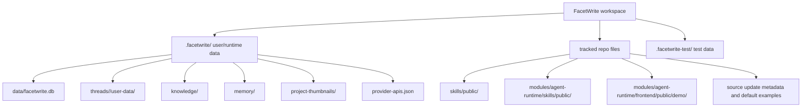

# Data Storage System

## Purpose

This document records the current FacetWrite data storage layout and the architecture plan for keeping user data, development/demo data, and Harness application updates separate. It is a planning document only; it does not define an implemented Harness updater yet.

It is based on code research, not assumptions. Primary code references:

- `server/storagePaths.ts`
- `server/storage.ts`
- `server/db/schema.ts`
- `server/knowledge/service.ts`
- `server/domains/model-config/providerApiConfigService.ts`
- `server/skillLoader.ts`
- `scripts/import-scientific-agent-skills.mjs`
- `modules/agent-runtime/backend/packages/harness/deerflow/skills/storage/local_skill_storage.py`
- `modules/agent-runtime/backend/packages/harness/deerflow/skills/installer.py`

## Current Storage Layers

FacetWrite is local-first. Runtime product data is stored under `.facetwrite/` by default, but the app-root override is not yet uniform across every subsystem. `FACETWRITE_APP_ROOT` is honored by the main SQLite database, thread workspaces, and project thumbnail paths through `server/storagePaths.ts`; provider API config, Knowledge files, and Memory currently resolve directly under `process.cwd()/.facetwrite`.

## App Root Override Caveat

`FACETWRITE_APP_ROOT` currently covers:

- main SQLite database path;
- thread `user-data/{workspace,uploads,outputs}` folders;
- project thumbnail cache.

`FACETWRITE_APP_ROOT` currently does not cover:

- `.facetwrite/provider-apis.json`;
- `.facetwrite/knowledge/**`;
- `.facetwrite/memory/**`.

This matters for tests, backup/restore planning, and any future Harness updater. Documentation and future code should avoid saying that `FACETWRITE_APP_ROOT` redirects all FacetWrite data until these paths are unified.

## User Data

| Area | Location | Owner | Notes |
| --- | --- | --- | --- |
| Primary product database | `.facetwrite/data/facetwrite.db` | FacetWrite backend | SQLite database created by `createStorage()` and migrated by `migrateStorageSchema()`. |
| Projects and threads | SQLite tables `projects`, `threads` | FacetWrite backend | Threads belong to projects; later migrations made Canvas project-scoped rather than thread-owned. |
| Messages and run audit | `messages`, `runs`, `tool_events`, `output_versions`, `run_activities` | FacetWrite backend | Stores visible assistant text, versioned outputs, tool/audit events, and plan activity summaries. |
| Canvas data | `canvas_nodes`, `canvas_edges`, `canvas_objects`, `canvas_write_requests`, `canvas_write_suggestions` | FacetWrite backend | Canvas free objects and AI write proposals are product data. Asset bytes live in thread `user-data/uploads`. |
| Plans | `plan_runs`, `plan_steps`, `plan_artifacts`, `plan_artifact_links`, `plan_executions` | FacetWrite backend | Product-owned plan lifecycle and artifact state. |
| Claims | `claim_candidates` | FacetWrite backend | Claim review rows are tied to project, thread, source node, and source document path. |
| Agent clarification state | `agent_clarifications` | FacetWrite backend | Persisted pending/answered clarification prompts and safe resume context. |
| Agent settings | `agent_settings` | FacetWrite backend | Durable profile-level settings. Transient skill choices are not saved here. |
| Runtime settings | `project_runtime_settings` | FacetWrite backend | Project defaults for runtime budget profile and limits. |
| Model bindings | `project_model_bindings`, thread/run `configured_model_api_id` | FacetWrite backend | Links projects/threads/runs to configured model API rows. |
| Provider API credentials | `.facetwrite/provider-apis.json` | Model Config service | Local plaintext configured model API bindings. Ignored by Git. API responses expose only `keyConfigured` and `keyHint`. |
| Legacy env settings | `.env.local` | Settings service | May contain `OPENAI_API_KEY`, base URL, model, and auth settings. Ignored by Git. |
| Thread files | `.facetwrite/threads/<threadId>/user-data/{workspace,uploads,outputs}` | Storage path manager and runtime archive services | Mirrors `/mnt/user-data/...` virtual paths. Markdown outputs are read from `outputs`. |
| Knowledge metadata | SQLite tables `knowledge_bases`, `knowledge_items`, `knowledge_item_events` | Knowledge service and repository | Metadata only. Vector data and uploaded bytes are stored on disk. |
| Knowledge vectors | `.facetwrite/knowledge/<baseId>/vectors.db` | Knowledge service | LibSQL vector store created per knowledge base. |
| Knowledge uploads | `.facetwrite/knowledge/uploads/<baseId>/` | Knowledge service | Browser-uploaded files, capped at 20MB per file. |
| Memory | `.facetwrite/memory/` | Agent runtime memory bridge | FacetWrite-managed memory content. AgentBackend legacy global memory is separate. |
| Project thumbnails | `.facetwrite/project-thumbnails/<projectId>.png|webp` plus `.json` metadata | Electron/app shell and storage service | Local-only thumbnail cache. Not synchronized. |

Important boundary: `.facetwrite/` and `.env.local` are ignored by Git. They are local user/runtime data and must not be committed, packaged into sample data, or used as upstream update inputs.

## Configuration Storage

Configuration is split between tracked defaults, local runtime secrets, and persisted product settings.

| Area | Location | Owner | Update rule |
| --- | --- | --- | --- |
| Example env templates | `.env.local.example`, `modules/agent-runtime/.env.example` | Repo docs/config authors | Public defaults may be updated by the first-stage source Git updater or a future packaged Harness release. |
| Real local env | `.env.local`, `modules/agent-runtime/.env` | Local developer/user | Git-ignored. Harness updates must never write these files. |
| Provider/model registry | `shared/model/data.ts` and related registry code | Source code | Current provider catalog is code-defined application code. It may change only through normal source/release updates, not through user data mutation. |
| Configured model APIs and keys | `.facetwrite/provider-apis.json` | Model Config service | Plaintext local secret store. Writes require `confirmLocalKeyWrite=true`; API responses expose only `keyConfigured`/`keyHint`. Never update from GitHub. |
| Thread model selection | `threads.configured_model_api_id` | FacetWrite backend | User/project runtime state in SQLite. Never update from GitHub. |
| Project runtime budget settings | `project_runtime_settings` | FacetWrite backend | User/project runtime state in SQLite. Never update from GitHub. |
| Agent settings | `agent_settings` | FacetWrite backend | User profile settings in SQLite. Source updates may provide sample Agent definitions, but must not overwrite saved user settings. |
| Skill catalog metadata | `skills/public/**/SKILL.md`, optional `facetwrite.skill.json` | Project public skill catalog | Git-tracked application asset root; eligible for first-stage source Git updates. |
| Runtime public skills | `modules/agent-runtime/skills/public/**` | Runtime package | Read-only in FacetWrite UI; update with Harness/Agent Runtime package changes, not user GitHub links. |

The most important security boundary is that real credentials live outside tracked source and outside the application update surface.

## Project Storage

Projects are the workspace boundary. The database stores the project shell, while thread files and thumbnails live on disk.

- `projects` stores top-level workspace title, summary, timestamps, and trash state.
- `threads` stores conversations inside a Project and the explicit `configured_model_api_id` for that Thread.
- `project_briefs` stores reusable Project Brief JSON.
- `thread_task_briefs` stores Current Task Brief JSON per Thread.
- `project_runtime_settings` stores Project-level Agent runtime budget defaults.
- `canvas_nodes`, `canvas_edges`, and `canvas_objects` are physically and logically Project-owned through `project_id`.
- `canvas_write_requests` and `canvas_write_suggestions` are safety/proposal records for Agent-originated Canvas changes.
- `plan_runs`, `plan_steps`, `plan_artifacts`, and `plan_executions` store product-owned Plan state.
- Thread generated/user files live under `.facetwrite/threads/<threadId>/user-data/` and are referenced by Canvas/file metadata rather than stored as blobs in SQLite.
- Project thumbnails live under `.facetwrite/project-thumbnails/` and are cache artifacts derived from the local Canvas surface.

Current Project storage is not designed to be replaced or modified by a Harness application update. A future release may add public examples or templates that users can import into a new Project, but it must not mutate existing `projects`, `threads`, Canvas rows, user files, or configured model references.

## Development And Sample Data

Development data currently falls into three groups:

| Area | Location | Purpose | Git-tracked |
| --- | --- | --- | --- |
| Example env files | `.env.local.example`, `modules/agent-runtime/.env.example` | Show required variables and placeholders. | Yes |
| Public project skills | `skills/public/**` | Project-provided skills surfaced in the UI. | Yes |
| Runtime public skills | `modules/agent-runtime/skills/public/**` | Read-only upstream/runtime skills surfaced as `agent-runtime` source. | Yes |
| Imported scientific skills manifest | `skills/public/scientific-agent-skills.import.json` | Records upstream repo, ref, commit, import time, and selected skill metadata. | Yes |
| Agent Runtime demo threads | `modules/agent-runtime/frontend/public/demo/threads/**` | Demo conversations and demo `/mnt/user-data` outputs/uploads for the runtime frontend. | Yes |
| Test storage roots | `.facetwrite-test/**`, `.pytest-tmp/**` | Local generated test/e2e artifacts. | No, ignored/generated |

The code treats project skills as manageable only when they come from `skills/public`. Skills from `modules/agent-runtime/skills/public` are read-only in the FacetWrite UI.

## Existing Update Mechanisms

### Database Schema Migration

`server/db/schema.ts` owns SQLite schema creation and migration. It creates base tables, applies additive migrations, and records applied versions in `schema_version`.

Historical note: earlier migrations include destructive reset steps for old pre-project-boundary data. Future migrations must document whether they are additive, destructive, or one-time compatibility resets.

### User Data Runtime Updates

User data changes happen through product APIs and repositories:

- `server/storage.ts` composes repositories for projects, threads, Canvas, plans, claims, knowledge, runs, and settings.
- `server/storagePaths.ts` ensures thread workspace paths stay under the resolved app root.
- `server/knowledge/service.ts` writes knowledge metadata to SQLite, uploaded files under `.facetwrite/knowledge/uploads`, and vector stores under `.facetwrite/knowledge/<baseId>/vectors.db`.
- `server/domains/model-config/providerApiConfigService.ts` writes configured model API bindings to `.facetwrite/provider-apis.json`.

### Skill Import From GitHub

The closest existing mechanism to "pull updates through a GitHub link" is `scripts/import-scientific-agent-skills.mjs`.

Current behavior:

- Uses GitHub API to read `K-Dense-AI/scientific-agent-skills` at `main`.
- Reads the upstream commit SHA.
- Recursively lists selected upstream skill directories.
- Downloads each file from its `download_url`.
- Writes normalized skills into `skills/public/<group>/<skill>/`.
- Writes per-skill `facetwrite.skill.json` with upstream repo/path/commit/url metadata.
- Writes `skills/public/scientific-agent-skills.import.json` as the import manifest.
- Asserts all writes stay inside the workspace.

This is a script-level import path for one curated skill source. It is not the Harness full-update system and should not be generalized into an application updater. First-stage Harness updates use the current source Git checkout and preserve the user data boundary described below.

### Skill Archive Installation

Agent Runtime also supports local `.skill` archive installation for custom skills:

- `LocalSkillStorage.ainstall_skill_from_archive()` installs `.skill` ZIP archives into the custom skill area.
- `installer.py` rejects unsafe ZIP paths, skips symlinks, enforces an uncompressed size limit, validates `SKILL.md`, and runs a security scan over installable prompt/script files.

This is local archive installation, not Harness application update.

## Source Git Update Planning Model

The first-stage update system is a Harness/App Shell source Git update mechanism for the current OpenCanvas development checkout. It updates Git-tracked application shell code, frontend/backend source, Agent Runtime source, built-in Skills, demo/example/template assets, docs, and default examples. It does not update user projects, user configuration, local credentials, or runtime data.

The first supported update channel is the allowlisted `origin/main` ref in the current checkout. The updater must never clone, worktree, mirror, copy a repository, or synchronize arbitrary GitHub URLs into the workspace.

1. Preview
   - Electron/App Shell runs `git fetch --prune origin` only when the user requests a refreshed preview.
   - Resolve `origin/main` to an immutable commit SHA before presenting any apply action.
   - Preview lists current branch, current HEAD, target SHA, ahead/behind counts, changed files, dependency changes, protected-path changes, and blockers.
   - Preview is read-only for the worktree and must not mutate application or user data files.

2. Apply
   - Electron/App Shell is the only component allowed to apply the source update.
   - Apply requires a clean worktree, non-detached HEAD, allowlisted origin remote, expected HEAD match, no protected-path changes, and a fast-forward target.
   - Apply uses `git merge --ff-only <resolvedCommit>` after preview validation. It does not stash, rebase, reset, resolve conflicts, or create merge commits.
   - Express may expose update status or preview data later, but it must not run Git or overwrite its own running code.

3. Dependency and restart handling
   - If `package.json` or `package-lock.json` changes, run `npm.cmd install` inside the current workspace after the fast-forward merge.
   - Agent Runtime Python dependencies remain managed by the existing workspace-local runtime launcher; source changes force a Shell restart so the normal bootstrap path can sync them.
   - After apply, Electron/App Shell relaunches and exits the current process. Vite HMR is not the update boundary.

4. Data and migration boundary
   - SQLite database files are never replaced by a source update.
   - Schema changes must run through versioned migrations in `server/db/schema.ts` or a successor migration layer.
   - Migrations must be documented as additive, destructive, or one-time compatibility resets before shipping.
   - User content remains local product data even when application code changes.

5. Rollback and recovery
   - Version control provides the source history, but v1 does not perform automatic rollback.
   - If apply cannot fast-forward cleanly, it fails before changing the worktree.
   - Future rollback may restore application files only; it must not restore, delete, or rewrite user projects, Thread files, Knowledge stores, Memory, credentials, thumbnails, or environment files.
   - If any path is ambiguous, the updater must refuse to write it.

6. Verification
   - Verify clean worktree, target SHA, changed files, path allowlists, and protected path exclusions before apply.
   - Reject `.facetwrite/**`, `FACETWRITE_APP_ROOT` data paths, `.env*`, provider API stores, SQLite files, Thread user-data, Knowledge, Memory, thumbnails, `.git/**` outside normal Git metadata operations, `node_modules/**`, `.venv/**`, `.uv-cache/**`, and test/runtime temp roots.
   - After apply, restart Harness and let normal startup migrations run.

### Future Packaged Release Update

When OpenCanvas reaches a packaged distribution stage, a second update path may use immutable GitHub Release artifacts such as `harness-<version>.zip` plus `manifest.json`, artifact SHA-256, file inventory, protected paths, migration metadata, and rollback bookkeeping. That future path shares the same protected-data rules but is not the first-stage updater.

## Protected Data For Harness Updates

Harness updates must never modify these locations, whether they are under the default `.facetwrite` root or a future unified `FACETWRITE_APP_ROOT`:

- `.facetwrite/data/facetwrite.db`, WAL, and SHM files;
- `.facetwrite/threads/**`;
- `.facetwrite/knowledge/**`;
- `.facetwrite/memory/**`;
- `.facetwrite/project-thumbnails/**`;
- `.facetwrite/provider-apis.json`;
- `.env`, `.env.*`, `.env.local`, and `modules/agent-runtime/.env`;
- `.facetwrite-test/**`, `.pytest-tmp/**`, `.agent-tmp/**`, `.git/**`, and `node_modules/**`.

Development/demo data, built-in Skills, templates, and docs may be updated as Git-tracked application assets by source updates. They must not be imported directly into existing Projects unless the user explicitly runs a product import flow.

## Documentation Plan

Use this document as the top-level map. The next documentation slices should be:

1. `docs/DATABASE.md`
   - Keep as the table/schema reference.
   - Add cross-link to this document for storage boundaries.

2. `docs/SECURITY.md`
   - Cross-link credential storage rules for `.env.local` and `.facetwrite/provider-apis.json`.
   - Explicitly state that provider API keys are local plaintext secrets and Git-ignored.

3. `docs/SKILL_MANAGEMENT.md`
   - Clarify project skills vs runtime skills vs custom runtime skills.
   - Note that built-in Skill updates arrive through source Git updates in the first stage, while custom runtime Skill archive installation remains local.

4. Harness update ADR
   - Record source Git updates as the first-stage Harness update mechanism.
   - Record why clone, worktree, mirror, arbitrary GitHub URL updates, automatic stash, rebase, reset, and conflict resolution are rejected.

## Open Questions

- What packaging layout will production Harness use for separating application install files from user data on Windows?
- How much rollback state should the App Shell keep for failed updates?
- Should future release artifacts be additionally signed beyond GitHub Release provenance and SHA-256 checksums?
- What UI copy best explains the difference between updating the Harness application and importing example/template data into a Project?
